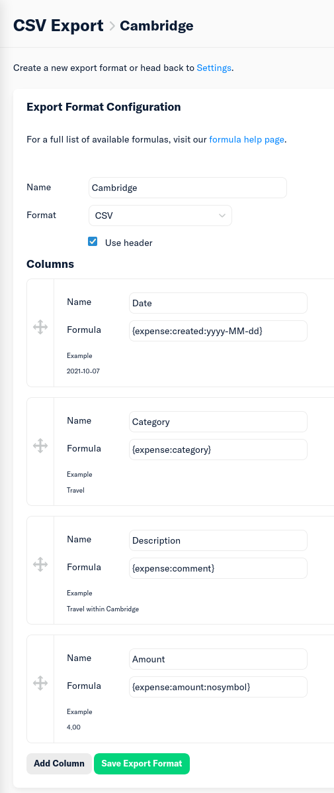

# Cambridge CL expense form filler

This LaTeX script fills in the [CL expense form](template.pdf) using data from
a file [`expenses.csv`](expenses.csv).

Usage:

1. Obtain `expenses.csv`. Example:

    ```csv
    Date,Category,Description,Amount
    2021-10-07,Travel,"Train ticket",40.00
    2021-10-07,Subsistence,Dinner,10
    ...etc...
    ```

2. Edit the section marked `CHANGE ME` in [report.tex](report.tex) to reflect
   your details.
3. Compile (may need to run more than once), e.g. `latexmk -pdf report.tex`.

The example output is available [here](misc/example_report.pdf).

## Pain-free CSVs and receipt collection

[Expensify](https://www.expensify.com/) is a free service which can be used in
real-time to collect receipts on a smartphone, and uses machine learning to
automatically fill in metadata from receipt photos. It can generate a PDF
containing photos of all receipts, and it is also able to generate a CSV (but
only from the webapp) in the format expected by this script, providing an
export format is setup (Settings → Account → Preferences → CSV Export Formats →
New Export Format) as follows:



You should also setup custom categories for expenses (this can only be done
from a phone?), called

* Travel
* Accommodation
* Conference fees
* Subsistence

to match that of the form.
